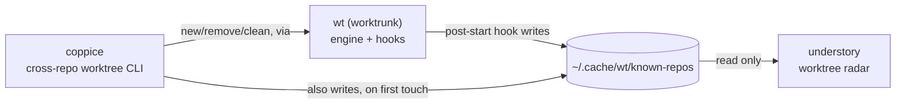

# understory

A live radar for git worktrees: every worktree of every repo it knows
about (see "Worktree discovery" below), most recently committed first,
with open-or-focus-a-VS-Code-window on Enter.

understory is the read-only, always-on counterpart to `wt`/coppice, which
do the actual worktree work; see [Ecosystem](#ecosystem) below for how
all the pieces fit together.

## Ecosystem

understory is one of four tools that split "what's running, and where, on
this machine" into two independent radars over two independent lifecycle
tools, one pair for git worktrees, one pair for agent sessions:

| Tool | Layer | Job |
|---|---|---|
| [`wt`](https://worktrunk.dev) (worktrunk) | engine | creates/removes worktrees, runs lifecycle hooks (`post-start`, `pre-remove`, ...), maintains the shared registry |
| [coppice](https://github.com/luiul/coppice) | lifecycle CLI | cross-repo `new`/`list`/`remove`/`clean` worktrees, on top of `wt`, from anywhere on disk |
| **understory** (this repo) | worktree radar | live, read-only dashboard of every worktree in the registry; open-or-focus a VS Code window on Enter |
| [canopy](https://github.com/luiul/canopy) | agent radar | live, read-only dashboard of every agent CLI session on the machine; jump-to-window on Enter |



canopy doesn't appear in that diagram: it's fully independent of `wt`'s
registry and of the other three tools here, discovering agent processes
directly via `ps`/`lsof` and AppleScript for Ghostty, rather than reading
anything worktree-related. It's included in the table above because the
two dashboards (canopy, understory) are meant to run side by side, each a
single-view radar over one kind of thing, rather than one tool trying to
cover both. That's not an accident of scope, it's the *reason* this repo
exists: understory started as a second view inside canopy itself
(agent-to-worktree matching, jump-to-worktree), and was pulled out into
its own tool specifically so canopy's job could stay "agent sessions,"
nothing else, and this one's could stay "worktrees," nothing else. See
[What this deliberately doesn't do](#what-this-deliberately-doesnt-do)
for the one piece of that old view intentionally not carried over.

## What it looks like

```
understory — worktrees on this machine
6 worktrees

   Repo              Branch          Updated   Status    Path
>  luiul/understory  main            12s       !?^|      ~/projects/personal/understory
   hellofresh/isa…   fix-writeback   3d        ⊂         ~/worktrees/.../isa-orchestration
   luiul/dotfiles    main            1h26m     ^|        ~/dotfiles
   ...

↑/↓ move · enter open/focus · r refresh · q quit
```

The currently selected row is marked with a `>` in the leftmost column.
Path shortens a leading home-directory prefix to `~`, same as your shell
prompt. Status is `wt`'s own compact status glyphs (dirty/ahead/behind),
reused as-is rather than re-derived here.

Enter opens (or, if a window is already open on that path, focuses) a VS
Code window there: `code --reuse-window <path>`, not `-n`/`--new-window`,
since Enter on a row gets pressed repeatedly and `-n` would stack up a
duplicate window on every press instead of reusing the one already there.

## Worktree discovery

understory reads the same shared `~/.cache/wt/known-repos` registry `wt`'s
own `post-start` hook (see [worktrunk](https://worktrunk.dev)) and
[coppice](https://github.com/luiul/coppice) already populate, read only:
understory never writes to it. It also folds in the repo containing
whatever directory understory itself was launched from, if any and not
already listed, so the view isn't empty by default for a repo that's
never gone through `wt`/coppice. Requires `wt` on PATH for any data at
all; without it, understory says so instead of showing an empty list.

Each repo's main worktree (the original checkout, as opposed to a linked
worktree `wt`/coppice created for a branch) is hidden by default: it's
rarely the thing you're switching between, and its ever-present "main"
branch and clean status just added noise to every repo's block. Pass
`--show-main` to include it.

## What this deliberately doesn't do

There's no notion of "live" (an agent currently working inside a given
worktree, the way canopy's own Worktrees view once had): that would
require the same process-discovery machinery canopy already owns for its
own dashboard, and duplicating it here would recouple two tools that are
otherwise fully independent. If you want to know whether something is
actively running in a given worktree, that's canopy's job, not
understory's.

## Why Go, not Python (like coppice)

Same reasoning as canopy: this is 100% subprocess orchestration (`wt
list`, `code --reuse-window`) and a polling TUI, no real computation, so a
single compiled binary with instant startup fits better than a Python
interpreter + venv. coppice stays Python because its job (`new`, `list`,
`remove`, `clean`) is closer to a scriptable CLI than a long-running
dashboard.

## Architecture

- `internal/worktree`: shells out to `wt list --format json`. Reads the
  shared `~/.cache/wt/known-repos` registry (read only) to find every repo
  to ask about.
- `internal/vscode`: opens or focuses a VS Code window on a plain path.
- `internal/tui`: the Bubble Tea dashboard (table, polling timer,
  open-on-Enter, notifications).
- `cmd/understory`: the CLI entry point (flags, version).

## Install

```bash
cd understory
go build -o /tmp/understory-build ./cmd/understory
install -m 0755 /tmp/understory-build ~/.local/bin/understory   # or anywhere on PATH
```

Or, if `$(go env GOPATH)/bin` (usually `~/go/bin`) is on your `PATH`:

```bash
go install ./cmd/understory
```

Requires `wt` (worktrunk) on PATH; without it, understory has nothing to
show and says so.

## Development

```bash
go build ./...
go vet ./...
go test ./...
gofmt -l .   # should print nothing
```

## Limitations

- Same machine, same user only.
- No "live" agent awareness (see above) — by design, not a gap to fill.
- Mouse click-to-select isn't implemented (keyboard only: arrow keys +
  Enter); Bubble Tea's table widget doesn't ship row-click handling out of
  the box the way Textual's `DataTable` does.
