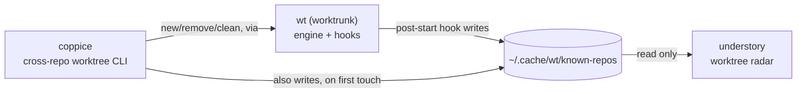

# understory

A live radar for git worktrees: every worktree of every repo it knows
about (see "Worktree discovery" below), most recently committed first,
with open-or-focus-a-VS-Code-window on Enter.

understory is the read-only, always-on counterpart to `wt`/coppice, which
do the actual worktree work; see [Ecosystem](#ecosystem) below for how
all the pieces fit together.

## Ecosystem

understory is one of four tools that split "what's running, and where, on
this machine" into two independent radars over two independent lifecycle
tools, one pair for git worktrees, one pair for agent sessions:

| Tool | Layer | Job |
|---|---|---|
| [`wt`](https://worktrunk.dev) (worktrunk) | engine | creates/removes worktrees, runs lifecycle hooks (`post-start`, `pre-remove`, ...), maintains the shared registry |
| [coppice](https://github.com/luiul/coppice) | lifecycle CLI | cross-repo `new`/`list`/`remove`/`clean` worktrees, on top of `wt`, from anywhere on disk |
| **understory** (this repo) | worktree radar | live, read-only dashboard of every worktree in the registry; open-or-focus a VS Code window on Enter |
| [canopy](https://github.com/luiul/canopy) | agent radar | live, read-only dashboard of every agent CLI session on the machine; jump-to-window on Enter |



canopy doesn't appear in that diagram: it's fully independent of `wt`'s
registry and of the other three tools here, discovering agent processes
directly via `ps`/`lsof` and AppleScript for Ghostty, rather than reading
anything worktree-related. It's included in the table above because the
two dashboards (canopy, understory) are meant to run side by side, each a
single-view radar over one kind of thing, rather than one tool trying to
cover both. That's not an accident of scope, it's the *reason* this repo
exists: understory started as a second view inside canopy itself
(agent-to-worktree matching, jump-to-worktree), and was pulled out into
its own tool specifically so canopy's job could stay "agent sessions,"
nothing else, and this one's could stay "worktrees," nothing else. See
[What this deliberately doesn't do](#what-this-deliberately-doesnt-do)
for the one piece of that old view intentionally not carried over.

## What it looks like

```
understory — worktrees on this machine
2 worktrees

   Repo                  Branch          Updated   Closed   Worktree  Merge      Path
>  luiul/understory      hide-main-wt    12s                dirty     unmerged   ~/worktrees/.../understory
   hellofresh/isa-orch…  fix-writeback   3d        2m       clean     unmerged   ~/worktrees/.../isa-orchestration

↑/↓ move · enter open/focus · r refresh · q quit
```

Each repo's main worktree (`Entry.IsMain`: the base-branch checkout
`wt`/coppice created the others alongside, not necessarily a branch named
"main") is hidden by default, since it rarely has anything to do (its
Merge column is always `-`, nothing to merge it into) and would otherwise
take the first row of every repo's block whether or not there's actually
any work going on there. Pass `--show-main` to include it; a repo with no
other worktrees at all shows nothing without that flag.

The currently selected row is marked with a `>` in the leftmost column.
Path shortens a leading home-directory prefix to `~`, same as your shell
prompt. Repo grows to fit whichever owner/repo label is longest across
the currently displayed worktrees, rather than a fixed width, so a long
name is never truncated (unlike Branch, which is fixed-width and can
still ellipsize). Worktree/Merge are plain-word renderings of `wt`'s own
compact status glyphs (dirty/ahead/behind), rather than the glyphs
themselves. Closed shows how long ago understory observed that
worktree's VS Code window go from open to closed (blank if it's still
open, or its close happened before understory started watching) — a
quick way to notice an accidental close before you forget about it.

Enter opens (or, if a window is already open on that path, focuses) a VS
Code window there. Checks for an already-open window itself first, via
AppleScript against each window's title, and only forces a brand-new one
(`-n`) once it knows none is already open: `code --reuse-window` alone
turns out not to be enough for this, since it silently hijacks whichever
window was last active instead of opening a fresh one whenever no window
already has the given path open (confirmed both empirically and in
upstream reports, e.g. microsoft/vscode#121926) — exactly the case a
worktree row that's never been opened before hits on every first press.
Same-row repeated presses stay safe from duplicate windows precisely
because the already-open check finds that new window on every
subsequent press.

## Worktree discovery

understory reads the same shared `~/.cache/wt/known-repos` registry `wt`'s
own `post-start` hook (see [worktrunk](https://worktrunk.dev)) and
[coppice](https://github.com/luiul/coppice) already populate, read only:
understory never writes to it. It also folds in the repo containing
whatever directory understory itself was launched from, if any and not
already listed, so the view isn't empty by default for a repo that's
never gone through `wt`/coppice. Requires `wt` on PATH for any data at
all; without it, understory says so instead of showing an empty list.

## What this deliberately doesn't do

There's no notion of "live" (an agent currently working inside a given
worktree, the way canopy's own Worktrees view once had): that would
require the same process-discovery machinery canopy already owns for its
own dashboard, and duplicating it here would recouple two tools that are
otherwise fully independent. If you want to know whether something is
actively running in a given worktree, that's canopy's job, not
understory's.

## Why Go, not Python (like coppice)

Same reasoning as canopy: this is 100% subprocess orchestration (`wt
list`, `code --reuse-window`) and a polling TUI, no real computation, so a
single compiled binary with instant startup fits better than a Python
interpreter + venv. coppice stays Python because its job (`new`, `list`,
`remove`, `clean`) is closer to a scriptable CLI than a long-running
dashboard.

## Architecture

- `internal/worktree`: shells out to `wt list --format json`. Reads the
  shared `~/.cache/wt/known-repos` registry (read only) to find every repo
  to ask about.
- `internal/vscode`: opens or focuses a VS Code window on a plain path.
- `internal/tui`: the Bubble Tea dashboard (table, polling timer,
  open-on-Enter, notifications).
- `cmd/understory`: the CLI entry point (flags, version).

## Install

```bash
cd understory
go build -o /tmp/understory-build ./cmd/understory
install -m 0755 /tmp/understory-build ~/.local/bin/understory   # or anywhere on PATH
```

Or, if `$(go env GOPATH)/bin` (usually `~/go/bin`) is on your `PATH`:

```bash
go install ./cmd/understory
```

Requires `wt` (worktrunk) on PATH; without it, understory has nothing to
show and says so.

## Development

```bash
go build ./...
go vet ./...
go test ./...
gofmt -l .   # should print nothing
```

## Limitations

- Same machine, same user only.
- No "live" agent awareness (see above) — by design, not a gap to fill.
- Mouse click-to-select isn't implemented (keyboard only: arrow keys +
  Enter); Bubble Tea's table widget doesn't ship row-click handling out of
  the box the way Textual's `DataTable` does.
