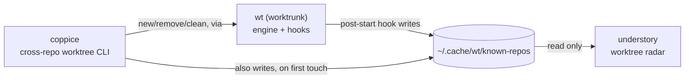

# understory

A live radar for git worktrees: every worktree of every repo it knows
about (see "Worktree discovery" below), most recently committed first,
with open-or-focus-a-VS-Code-window on Enter and confirmed removal on
`x`.

understory is the always-on counterpart to `wt`/coppice, which do the
actual worktree work; see [Ecosystem](#ecosystem) below for how
all the pieces fit together. It stays read-only except for one triage
action: removing worktrees, delegated to `wt remove` with a
confirmation prompt (see [Actions](#actions) below).

## Ecosystem

understory is one of four tools that split "what's running, and where, on
this machine" into two independent radars over two independent lifecycle
tools, one pair for git worktrees, one pair for agent sessions:

| Tool | Layer | Job |
|---|---|---|
| [`wt`](https://worktrunk.dev) (worktrunk) | engine | creates/removes worktrees, runs lifecycle hooks (`post-start`, `pre-remove`, ...), maintains the shared registry |
| [coppice](https://github.com/luiul/coppice) | lifecycle CLI | cross-repo `new`/`list`/`remove`/`clean` worktrees, on top of `wt`, from anywhere on disk |
| **understory** (this repo) | worktree radar | live dashboard of every worktree in the registry; open-or-focus a VS Code window on Enter, remove with confirmation on `x` |
| [canopy](https://github.com/luiul/canopy) | agent radar | live, read-only dashboard of every agent CLI session on the machine; jump-to-window on Enter |



canopy doesn't appear in that diagram: it's fully independent of `wt`'s
registry and of the other three tools here, discovering agent processes
directly via `ps`/`lsof` and AppleScript for Ghostty, rather than reading
anything worktree-related. It's included in the table above because the
two dashboards (canopy, understory) are meant to run side by side, each a
single-view radar over one kind of thing, rather than one tool trying to
cover both. That's not an accident of scope, it's the *reason* this repo
exists: understory started as a second view inside canopy itself
(agent-to-worktree matching, jump-to-worktree), and was pulled out into
its own tool specifically so canopy's job could stay "agent sessions,"
nothing else, and this one's could stay "worktrees," nothing else. See
[What this deliberately doesn't do](#what-this-deliberately-doesnt-do)
for the one piece of that old view intentionally not carried over.

## What it looks like

```
understory — worktrees on this machine
2 worktrees

Repo                  Branch          Created   Worktree  Merge      VS Code  Path
luiul/understory      hide-main-wt    12s       dirty     unmerged   open     ~/worktrees/.../understory
hellofresh/isa-orch…  fix-writeback   3d        clean     unmerged   -        ~/worktrees/.../isa-orchestration

↑/↓ move · enter open/focus · x remove · ? help · q quit
```

(the currently selected row also gets a full-width grey highlight in the
real terminal output, not shown here since it's just a background color)

Each repo's main worktree (`Entry.IsMain`: the base-branch checkout
`wt`/coppice created the others alongside, not necessarily a branch named
"main") is hidden by default, since it rarely has anything to do (its
Merge column is always `-`, nothing to merge it into) and would otherwise
take the first row of every repo's block whether or not there's actually
any work going on there. Pass `--show-main` to include it; a repo with no
other worktrees at all shows nothing without that flag.

The currently selected row is highlighted with a subtle grey background
spanning the full width of the table, rather than a leading marker glyph:
with rows grouped by repo, most of a block's rows look alike (blank Repo
cell, similar Branch/Worktree/Merge text), so a highlighted row is much
easier to keep track of while scrolling than a single character off to
the side. Path shortens a leading home-directory prefix to `~`, same as
your shell prompt. Repo and Branch each grow to fit whichever label or
branch name is longest across the currently displayed worktrees, rather
than a fixed width, so a long name is never truncated as long as the
terminal has room for everything; on one that doesn't, Repo/Branch shed
that growth first (longest-first, so truncation hits the longest values
first) and only then does Path dip below its own preferred width — the
table never overflows the terminal's right edge. Worktree/Merge are
plain-word renderings of `wt`'s own compact status glyphs
(dirty/ahead/behind), rather than the glyphs themselves. The VS Code
column tells you whether a VS Code window is already open on the
worktree (`open`, `-`, or `?` when the window listing itself couldn't
be read): it answers with the exact same already-open check Enter's
open-or-focus runs (see below), so `open` means Enter would focus that
window rather than open a new one.

Each internal column border can be dragged with the mouse to widen or
narrow it: the two columns it sits between trade width between
themselves, so the table's own total width never changes, only how it's
divided up between whichever two columns you actually grabbed (see
[`github.com/luiul/dashkit/trellis`](https://github.com/luiul/dashkit/tree/main/trellis),
the same package canopy uses for its own table). A visible divider marks
each border on the header row (see
[`github.com/luiul/dashkit/loam`](https://github.com/luiul/dashkit/tree/main/loam)'s
`DrawHeaderBorders`) so there's something to aim the drag at, rather than
an invisible 2-space gap. Every border can move in both directions:
each column can shrink down to the width its values still fit (Repo/
Branch their defaults, Created/Worktree/Merge/VS Code their widest
possible value — a narrower drag truncates only the header title, never
a value), and Path down to its own floor. A resize sticks across polls:
the dragged column's width is pinned exactly where you left it, even
when a freshly polled longer label would have grown it (the label
ellipsizes until you drag wider again) — only a terminal resize resets
every column, since that already recomputes Path's own width from
scratch against the new terminal width anyway. Columns you never
dragged keep their automatic sizing.

Enter opens (or, if a window is already open on that path, focuses) a VS
Code window there via [`github.com/luiul/dashkit/mycelium`](https://github.com/luiul/dashkit/tree/main/mycelium)'s
shared open-or-focus logic: it checks for an already-open window itself
first, via AppleScript against each window's title, and only forces a
brand-new one (`-n`) once it knows none is already open. `code
--reuse-window` alone turns out not to be enough for this, since it
silently hijacks whichever window was last active instead of opening a
fresh one whenever no window already has the given path open (confirmed
both empirically and in upstream reports, e.g. microsoft/vscode#121926)
— exactly the case a worktree row that's never been opened before hits
on every first press. Same-row repeated presses stay safe from
duplicate windows precisely because the already-open check finds that
new window on every subsequent press. canopy uses the exact same
mycelium package to jump to whichever window is running a given agent,
so this switch-or-create behavior lives in one shared place instead of
being duplicated across both tools.

## Actions

Everything other than removal is read-only. The removal keybindings all
ask for confirmation first (`y` confirms, `n`/`esc`/`enter` cancels, and
an unanswered prompt cancels itself after 10 seconds, since rows keep
repolling and reordering underneath it), then delegate to `wt remove`
(`git worktree remove --force` for stale registrations), the same
commands `cop remove` wraps:

| Key | Action |
|---|---|
| `x` | Remove the selected worktree. `wt` refuses one with uncommitted changes and deletes the branch only if merged; the prompt says which applies to the selected row. |
| `X` | Force remove: discards uncommitted changes and deletes the branch even if unmerged. |
| `P` | Prune every stale worktree registration (directories already gone; drops only the git metadata). |
| `M` | Remove every merged worktree of the selected row's repo, branches included. |
| `y` | Copy the selected worktree's full path to the clipboard (vim's yank). |
| `m` | Show or hide each repo's main worktree (same as `--show-main`, at runtime). |
| `?` | Full keybinding list. |

### Conventions

understory and canopy share one set of keybinding conventions, so muscle
memory transfers between the two dashboards: lowercase keys act on the
selected row or are reversible (`x`, `y`, `m`), uppercase keys are the
bulk or stronger form (`X`, `P`, `M`), every destructive action asks for
confirmation first, and `ctrl+c` always quits: from the table, from a
confirmation prompt, from the help overlay. The full set of shared
decisions (keybindings, the modal discipline, phrasing, rendering,
testing, releasing) is written down once in
[dashkit's CONVENTIONS.md](https://github.com/luiul/dashkit/blob/main/CONVENTIONS.md).

A removal's result (including `wt`'s own refusal reason, with a hint at
`X` when it refused a dirty worktree) shows on the status line, and a
successful removal refreshes the view immediately rather than waiting
for the next poll.

## Worktree discovery

understory reads the same shared `~/.cache/wt/known-repos` registry `wt`'s
own `post-start` hook (see [worktrunk](https://worktrunk.dev)) and
[coppice](https://github.com/luiul/coppice) already populate, read only:
understory never writes to it. It also folds in the repo containing
whatever directory understory itself was launched from, if any and not
already listed, so the view isn't empty by default for a repo that's
never gone through `wt`/coppice. Requires `wt` on PATH for any data at
all; without it, understory says so instead of showing an empty list.

The view polls on a slow interval (worktree state barely changes), but
also refreshes the moment the terminal window regains focus: the typical
flow is creating a worktree in another window (`cop new`, jira-worktree)
and then switching to understory to check it, and a worktree created
seconds ago shouldn't be invisible until the next tick.

## What this deliberately doesn't do

There's no notion of "live" (an agent currently working inside a given
worktree, the way canopy's own Worktrees view once had): that would
require the same process-discovery machinery canopy already owns for its
own dashboard, and duplicating it here would recouple two tools that are
otherwise fully independent. If you want to know whether something is
actively running in a given worktree, that's canopy's job, not
understory's.

## Why Go, not Python (like coppice)

Same reasoning as canopy: this is 100% subprocess orchestration (`wt
list`, `code --reuse-window`) and a polling TUI, no real computation, so a
single compiled binary with instant startup fits better than a Python
interpreter + venv. coppice stays Python because its job (`new`, `list`,
`remove`, `clean`) is closer to a scriptable CLI than a long-running
dashboard.

## Architecture

- `internal/worktree`: shells out to `wt list --format json`. Reads the
  shared `~/.cache/wt/known-repos` registry (read only) to find every repo
  to ask about.
- `internal/tui`: the Bubble Tea dashboard (table, polling timer,
  open-on-Enter via
  [`github.com/luiul/dashkit/mycelium`](https://github.com/luiul/dashkit/tree/main/mycelium)'s
  shared open-or-focus logic — the same package canopy uses to jump to
  whichever window is running a given agent — notifications, the
  confirmed-removal modal behind x/X/P/M, and the `?` help overlay, the
  modal's state machine and the overlay's renderer shared with canopy
  via
  [`github.com/luiul/dashkit/confirm`](https://github.com/luiul/dashkit/tree/main/confirm)
  and
  [`github.com/luiul/dashkit/loam`](https://github.com/luiul/dashkit/tree/main/loam)'s
  `HelpView`).
- `cmd/understory`: the CLI entry point (flags, version).

## Install

```bash
cd understory
scripts/install.sh   # builds, installs to ~/.local/bin, code-signs with a
                     # stable local identity so macOS Accessibility/
                     # Automation permission (needed by mycelium's
                     # window-detection AppleScript) survives future
                     # rebuilds instead of resetting every time -- see
                     # the script's own comment for why and how to set
                     # up that signing identity once
```

Or, without the stable signature (fine for a one-off build, but expect
to re-grant Accessibility/Automation to VS Code + System Events after
every rebuild):

```bash
cd understory
go build -o /tmp/understory-build ./cmd/understory
install -m 0755 /tmp/understory-build ~/.local/bin/understory   # or anywhere on PATH
```

Or, if `$(go env GOPATH)/bin` (usually `~/go/bin`) is on your `PATH`:

```bash
go install ./cmd/understory
```

Requires `wt` (worktrunk) on PATH; without it, understory has nothing to
show and says so.

## Development

```bash
go build ./...
go vet ./...
go test ./...
gofmt -l .   # should print nothing
```

## Limitations

- Same machine, same user only.
- No "live" agent awareness (see above) — by design, not a gap to fill.
- Mouse click-to-select isn't implemented (keyboard only: arrow keys +
  Enter); Bubble Tea's table widget doesn't ship row-click handling out of
  the box the way Textual's `DataTable` does.
